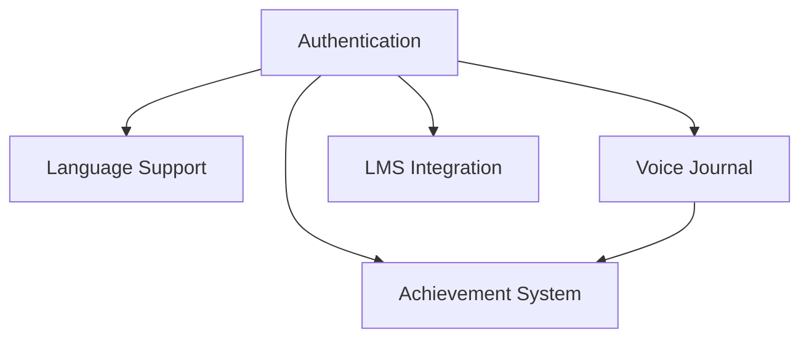

# 📋 SpeakWise Task Execution Plan [Months 2-3]

> Region: Lancang-Mekong
> Timeline: 8 weeks
> Budget: $500

## System Status

```
[■■■■■■■■□□] 80% Authentication
[■■■□□□□□□□] 20% Regional Support
[■■■■■□□□□□] 50% Voice Journal
[□□□□□□□□□□] 0%  Achievements
[□□□□□□□□□□] 0%  LMS Integration
```

## Task Tree

```bash
root
├── 1.0 Authentication System [HIGH] [IN_PROGRESS]
│   ├── 1.1 Clerk Setup [COMPLETED]
│   │   ├── $ create-clerk-account --project=speakwise ✓
│   │   ├── $ npm i @clerk/nextjs @clerk/themes ✓
│   │   └── $ setup-env --keys=clerk ✓
│   │
│   ├── 1.2 Auth Implementation [COMPLETED]
│   │   ├── $ touch app/providers/clerk-provider.tsx ✓
│   │   ├── $ mkdir app/(auth) ✓
│   │   └── $ setup-auth-routes --sign-in --sign-up ✓
│   │
│   └── 1.3 Protected Routes [COMPLETED]
│       ├── deps: [1.1, 1.2] ✓
│       └── files: [middleware.ts, types/user.ts] ✓
│
├── 2.0 Regional Language Support [HIGH] [IN_PROGRESS]
│   ├── deps: [1.0] ✓
│   │
│   ├── 2.1 Language Config [COMPLETED]
│   │   ├── $ create-component language-dialect-selector ✓
│   │   └── $ setup-language-profiles --region=lancang-mekong ✓
│   │
│   ├── 2.2 AI Calibration [COMPLETED]
│   │   ├── research: pronunciation-patterns ✓
│   │   └── update: analysis-prompts ✓
│   │
│   └── 2.3 Feedback System [IN_PROGRESS]
│       └── templates: [zh, my, lo, th, km, vi]
│
├── 3.0 Voice Journal [MEDIUM] [IN_PROGRESS]
│   ├── deps: [1.0]
│   │
│   ├── 3.1 Storage System [COMPLETED]
│   │   ├── service: vercel-blob-integration ✓
│   │   ├── database: prisma-schema ✓
│   │   └── api: voice-recordings ✓
│   │
│   ├── 3.2 Timeline View [IN_PROGRESS]
│   │   └── component: voice-journal/timeline
│   │
│   └── 3.3 Progress Tracking [PENDING]
│       └── feature: recording-comparison
│
├── 4.0 Achievement System [MEDIUM] [PENDING]
│   ├── deps: [1.0, 3.0]
│   │
│   ├── 4.1 Achievement Engine
│   │   └── service: progress-tracking
│   │
│   ├── 4.2 Certificates
│   │   └── generator: pdf-export
│   │
│   └── 4.3 Display
│       └── component: achievements-dashboard
│
└── 5.0 LMS Integration [MEDIUM] [PENDING]
    ├── deps: [1.0]
    │
    ├── 5.1 Moodle API
    │   └── research: web-services
    │
    ├── 5.2 Data Sync
    │   └── service: moodle-connector
    │
    └── 5.3 Course Management
        └── component: course-dashboard
```

## Implementation Details

### Authentication System

```yaml
status: COMPLETED
priority: HIGH
files:
  - app/providers/clerk-provider.tsx ✓
  - app/(auth)/sign-in/[[...sign-in]]/page.tsx ✓
  - app/(auth)/sign-up/[[...sign-up]]/page.tsx ✓
  - middleware.ts ✓
test: |
  - Verify Clerk integration ✓
  - Test protected routes ✓
  - Validate user session ✓
```

### Regional Language Support

```yaml
status: IN_PROGRESS
priority: HIGH
files:
  - utils/lm-language-dialect-profiles.ts ✓
  - utils/lm-dialect-prompts.ts ✓
  - components/language-dialect-selector.tsx ✓
test: |
  - Validate language profiles ✓
  - Test dialect detection ✓
  - Verify feedback accuracy [IN_PROGRESS]
```

### Voice Journal

```yaml
status: IN_PROGRESS
priority: MEDIUM
files:
  - services/storage.ts ✓
  - api/voice-recordings/route.ts ✓
  - api/voice-recordings/[id]/route.ts ✓
  - prisma/schema.prisma ✓
  - components/voice-journal/timeline.tsx
  - components/voice-journal/progress-comparison.tsx
test: |
  - Test blob storage ✓
  - Test database integration ✓
  - Test API endpoints ✓
  - Validate timeline display
  - Check progress metrics
```

### Achievement System

```yaml
status: PENDING
priority: MEDIUM
files:
  - services/achievement-tracker.ts
  - components/certificates/templates.tsx
  - components/certificates/share-dialog.tsx
test: |
  - Verify achievement triggers
  - Test PDF generation
  - Validate sharing features
```

### LMS Integration

```yaml
status: PENDING
priority: MEDIUM
files:
  - services/moodle-connector.ts
  - components/course-dashboard.tsx
test: |
  - Test Moodle API connection
  - Verify data synchronization
  - Validate course management
```

## Progress Tracking

```
Week 1: [■■■■■■■■■■] Authentication Setup
Week 2: [■■■■■□□□□□] Auth Implementation
Week 3: [■■□□□□□□□□] Language Support
Week 4: [■□□□□□□□□□] AI Calibration
Week 5: [■■■■■□□□□□] Voice Journal
Week 6: [□□□□□□□□□□] Achievements
Week 7: [□□□□□□□□□□] LMS Research
Week 8: [□□□□□□□□□□] Integration
```

## Dependencies Graph


